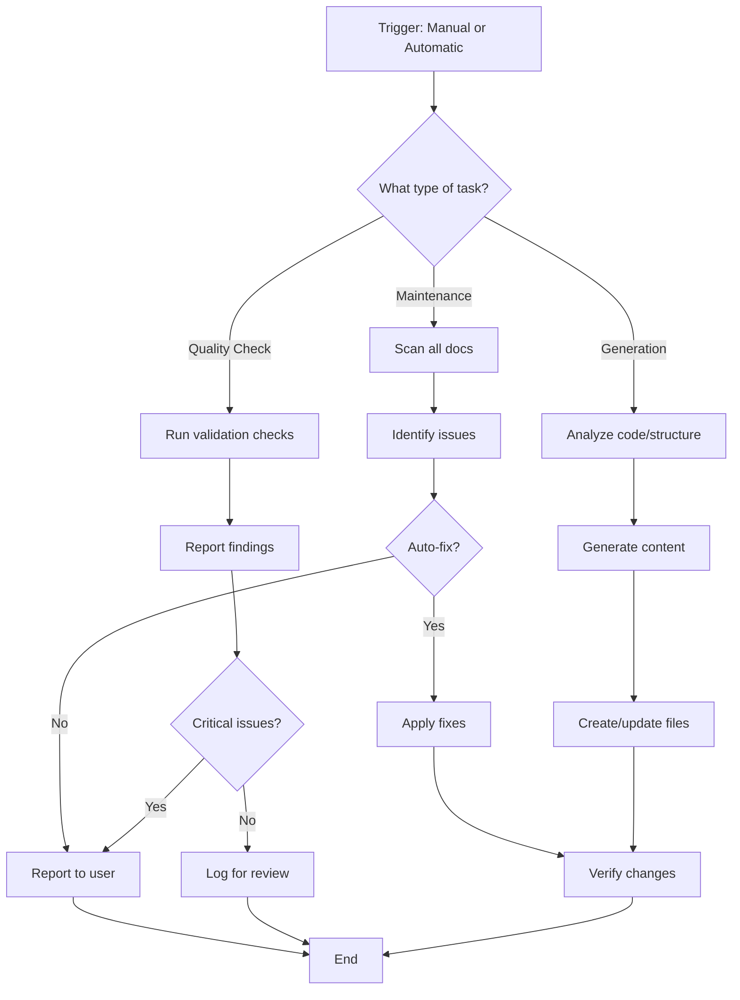

# Documentation Agent Specification

**Version**: 1.0
**Created**: October 6, 2025
**Status**: Specification for Manual Implementation

---

## Overview

The **documentation-manager** agent is a specialized agent designed to maintain, organize, and generate project documentation. It ensures documentation stays current, properly linked, and follows consistent standards.

---

## Agent Configuration

```yaml
Agent Name: documentation-manager
Agent Type: Specialized utility agent
Primary Role: Documentation maintenance and generation
Autonomy Level: Semi-autonomous (can be triggered manually or automatically)
```

---

## Core Responsibilities

### 1. Documentation Maintenance
- Keep all documentation files up-to-date
- Identify outdated information
- Cross-reference related documents
- Ensure internal links are valid
- Update "Last Modified" dates
- Maintain version history

### 2. Documentation Generation
- Generate README files for new directories
- Create API documentation from code
- Generate CHANGELOG entries
- Create table of contents for long documents
- Auto-generate documentation indexes
- Create cross-reference maps

### 3. Quality Assurance
- Check for broken internal links
- Verify external links (periodic checks)
- Ensure consistent formatting (Markdown style)
- Validate code examples in documentation
- Check for TODO markers in docs
- Ensure all images/assets exist

### 4. Organization
- Maintain documentation directory structure
- Create documentation indexes
- Tag and categorize documents
- Archive outdated documentation
- Consolidate scattered documentation

### 5. Standards Enforcement
- Enforce naming conventions
- Ensure consistent headings hierarchy
- Validate frontmatter/metadata
- Check for required sections
- Enforce style guide compliance

---

## Tool Access

The documentation-manager agent has access to:

### Primary Tools
- **Read** - Read existing documentation files
- **Write** - Create new documentation files
- **Edit** - Update existing documentation
- **Grep** - Search documentation content
- **Glob** - Find documentation files by pattern

### Secondary Tools (optional)
- **WebFetch** - Verify external links (if needed)
- **Bash** - Run documentation generators (JSDoc, TypeDoc, etc.)

---

## Trigger Conditions

### Manual Triggers
User explicitly invokes the agent:
```
"Update the documentation"
"Generate API docs"
"Check for broken links in docs"
"Create a README for the components directory"
```

### Automatic Triggers (Proactive)
Agent should automatically activate when:

1. **New Code Files Created**
   - Detect new directories without README files
   - Generate documentation stubs

2. **Significant Code Changes**
   - API changes detected (function signatures changed)
   - Component props modified
   - Configuration files updated

3. **Documentation Gaps Detected**
   - Missing required sections
   - Broken internal links
   - Outdated version numbers
   - Missing "Last Updated" dates

4. **Scheduled Maintenance**
   - Weekly documentation health check
   - Monthly link verification
   - Quarterly documentation review

---

## Agent Behavior & Workflow

### Standard Workflow



### Proactive Behavior

The agent should:
- **Never delete** documentation without user confirmation
- **Always preserve** existing content when updating
- **Create backups** before major restructuring
- **Ask for confirmation** before making breaking changes
- **Provide summaries** of changes made
- **Log all actions** for audit trail

---

## Documentation Standards

### File Naming Conventions
```
SCREAMING_SNAKE_CASE.md  - Major documentation files
lowercase-kebab-case.md   - Secondary documentation
README.md                 - Directory index files
CHANGELOG.md              - Version history
```

### Required Sections

All major documentation files should include:
```markdown
# Title

**Version**: X.X
**Last Updated**: YYYY-MM-DD
**Status**: Draft | Active | Deprecated

---

## Overview
Brief description of the document

## Table of Contents
(Auto-generated or manual)

## Main Content
...

---

**Last Updated**: [Date]
**Maintained By**: [Team/Person]
```

### Metadata/Frontmatter
```yaml
---
title: "Document Title"
version: "1.0"
last_updated: "2025-10-06"
status: "active"
tags: ["documentation", "api", "guide"]
related:
  - path/to/related-doc.md
  - path/to/another-doc.md
---
```

---

## Example Use Cases

### Use Case 1: New Component Created

**Trigger**: Developer creates `/components/MyNewComponent.tsx`

**Agent Actions**:
1. Detect new component file
2. Check if component is documented
3. If not, generate documentation stub:
   ```markdown
   # MyNewComponent

   ## Overview
   [Description needed]

   ## Props
   | Prop | Type | Default | Description |
   |------|------|---------|-------------|
   | ... | ... | ... | ... |

   ## Usage
   ```tsx
   <MyNewComponent />
   ```

   ## Examples
   [Add examples]
   ```
4. Add to component index
5. Notify user of new documentation

### Use Case 2: API Endpoint Modified

**Trigger**: Function signature changed in `/api/resources/route.ts`

**Agent Actions**:
1. Detect API change via git diff or file modification
2. Find related API documentation
3. Update endpoint documentation:
   - Update parameters
   - Update response schema
   - Update examples
4. Add CHANGELOG entry
5. Update API version number (if breaking change)
6. Flag for manual review if complex change

### Use Case 3: Documentation Health Check

**Trigger**: Weekly scheduled task or manual request: "Check docs health"

**Agent Actions**:
1. Scan all `.md` files in `/docs`
2. Check for:
   - Broken internal links
   - Missing "Last Updated" dates (>30 days old)
   - TODO markers
   - Orphaned files (not linked from index)
   - Missing required sections
3. Generate health report:
   ```markdown
   # Documentation Health Report
   **Generated**: 2025-10-06

   ## Summary
   - Total docs: 12
   - Health score: 85/100

   ## Issues Found
   - [ ] ROADMAP.md has broken link to non-existent file
   - [ ] API.md not updated in 45 days
   - [ ] 3 TODO markers found

   ## Recommendations
   - Update stale documentation
   - Fix broken links
   - Complete TODO items
   ```

### Use Case 4: Generate API Documentation

**Trigger**: User requests: "Generate API docs from code"

**Agent Actions**:
1. Scan all files in `/app/api` directory
2. Extract route handlers, parameters, responses
3. Generate comprehensive API documentation:
   ```markdown
   # API Reference

   ## Endpoints

   ### POST /api/newsletter
   Subscribe to newsletter

   **Request Body**:
   ```json
   {
     "email": "user@example.com"
   }
   ```

   **Response**: 200 OK
   ```json
   {
     "success": true,
     "message": "Subscribed successfully"
   }
   ```

   **Errors**:
   - 400: Invalid email
   - 500: Server error
   ```
4. Save to `/docs/API_REFERENCE.md`
5. Update documentation index

### Use Case 5: Create Missing README Files

**Trigger**: User requests: "Create README files for all directories"

**Agent Actions**:
1. Scan project structure
2. Find directories without README.md
3. For each directory:
   - Analyze contents (files, subdirectories)
   - Generate appropriate README template
   - Include file listing
   - Add purpose/description placeholder
   - Link to parent documentation
4. Report created files to user

---

## Configuration Options

### Agent Settings (stored in project config)

```json
{
  "documentation-manager": {
    "enabled": true,
    "auto_trigger": true,
    "documentation_path": "./docs",
    "standards": {
      "naming_convention": "SCREAMING_SNAKE_CASE",
      "max_age_days": 30,
      "require_last_updated": true,
      "require_version": true,
      "enforce_frontmatter": false
    },
    "generation": {
      "auto_readme": true,
      "auto_changelog": true,
      "auto_api_docs": false,
      "template_path": "./docs/templates"
    },
    "validation": {
      "check_links": true,
      "check_images": true,
      "check_code_examples": false,
      "max_link_age_days": 90
    },
    "exclusions": [
      "node_modules/**",
      ".next/**",
      "*.log"
    ]
  }
}
```

---

## Templates

### README Template
```markdown
# [Directory/Component Name]

**Purpose**: [Brief description]

## Contents

[Auto-generated file listing]

## Overview

[Description of what this directory/component contains]

## Usage

[How to use/access this]

## Related Documentation

- [Link to related docs]

---

**Last Updated**: [Auto-generated date]
```

### API Documentation Template
```markdown
# API Endpoint: [Method] [Path]

## Description
[What this endpoint does]

## Authentication
[Required auth, if any]

## Request

**Method**: [GET|POST|PUT|DELETE|PATCH]
**Path**: [/api/path/:param]

**Parameters**:
| Name | Type | Required | Description |
|------|------|----------|-------------|
| ... | ... | ... | ... |

**Request Body** (if applicable):
```json
{
  "example": "value"
}
```

## Response

**Success (200)**:
```json
{
  "success": true,
  "data": {}
}
```

**Errors**:
- 400: [Description]
- 404: [Description]
- 500: [Description]

## Examples

[Code examples]

---

**Last Updated**: [Date]
```

### CHANGELOG Entry Template
```markdown
## [Version] - YYYY-MM-DD

### Added
- [New features]

### Changed
- [Changes to existing functionality]

### Deprecated
- [Soon-to-be removed features]

### Removed
- [Removed features]

### Fixed
- [Bug fixes]

### Security
- [Security improvements]
```

---

## Integration Points

### With Other Agents

**test-writer-fixer**:
- When tests are added/modified, update test documentation
- Generate test coverage reports

**frontend-developer**:
- When components are created, generate component docs
- Update component library documentation

**backend-architect**:
- When APIs change, update API documentation
- Generate schema documentation

**brand-guardian**:
- Ensure documentation follows brand voice
- Update brand guidelines documentation

---

## Output Examples

### Documentation Health Report
```markdown
# Documentation Health Report

**Generated**: October 6, 2025 14:32:00
**Documentation Path**: /cloudfix-nextjs/docs
**Total Documents**: 12

---

## Health Score: 78/100

### Status Breakdown
- ✅ Excellent: 5 documents (42%)
- ⚠️  Needs Attention: 4 documents (33%)
- ❌ Critical Issues: 3 documents (25%)

---

## Issues Found

### Critical Issues (3)

1. **ROADMAP.md**
   - ❌ Broken internal link: `./COMPONENT_LIBRARY.md` (file not found)
   - Line 145

2. **API_REFERENCE.md**
   - ❌ Document not updated in 60 days (last: 2025-08-07)
   - Missing required section: "Authentication"

3. **DEPLOYMENT_GUIDE.md**
   - ❌ External link broken: https://old-domain.com/guide (404)
   - Line 89

### Needs Attention (4)

1. **FRONTEND_TECHNICAL_ANALYSIS.md**
   - ⚠️  Contains 5 TODO markers
   - Lines: 234, 567, 789, 1023, 1456

2. **MIGRATION_GUIDE.md**
   - ⚠️  Not updated in 35 days (last: 2025-09-01)

3. **README.md**
   - ⚠️  Missing "Last Updated" date

4. **BRAND_CONSISTENCY_AUDIT.md**
   - ⚠️  Not linked from any index file (orphaned)

---

## Recommendations

### Immediate Actions
1. Fix broken links in ROADMAP.md
2. Update API_REFERENCE.md with authentication section
3. Verify/fix external link in DEPLOYMENT_GUIDE.md

### Soon
1. Complete TODO items in FRONTEND_TECHNICAL_ANALYSIS.md
2. Review and update MIGRATION_GUIDE.md
3. Add "Last Updated" to README.md
4. Link BRAND_CONSISTENCY_AUDIT.md from documentation index

### Maintenance
- Consider setting up automated link checking (weekly)
- Create templates for common documentation types
- Establish documentation review schedule (monthly)

---

**Next Health Check**: October 13, 2025
```

### Link Validation Report
```markdown
# Documentation Link Validation Report

**Scanned**: October 6, 2025 14:35:00
**Documents Scanned**: 12
**Total Links**: 87

---

## Summary

- ✅ Valid Links: 79 (91%)
- ❌ Broken Links: 5 (6%)
- ⚠️  Redirects: 3 (3%)

---

## Broken Internal Links (3)

1. **In: ROADMAP.md (line 145)**
   - Link: `[Component Library](./COMPONENT_LIBRARY.md)`
   - Target: `./COMPONENT_LIBRARY.md`
   - Error: File not found
   - **Fix**: Create file or update link

2. **In: API_REFERENCE.md (line 67)**
   - Link: `[Authentication Guide](../auth/README.md)`
   - Target: `../auth/README.md`
   - Error: File not found
   - **Fix**: Create auth docs or remove link

3. **In: docs/README.md (line 28)**
   - Link: `[Old Migration Doc](./MIGRATION_V1.md)`
   - Target: `./MIGRATION_V1.md`
   - Error: File not found
   - **Fix**: Remove outdated link

---

## Broken External Links (2)

1. **In: DEPLOYMENT_GUIDE.md (line 89)**
   - Link: `https://old-domain.com/guide`
   - Status: 404 Not Found
   - **Fix**: Update to new URL or remove

2. **In: NEXT_JS_MIGRATION_SUMMARY.md (line 234)**
   - Link: `https://deprecated-api.example.com`
   - Status: 404 Not Found
   - **Fix**: Update to current API docs

---

## Redirects (3)

1. **In: README.md (line 45)**
   - Link: `http://nextjs.org/docs`
   - Redirects to: `https://nextjs.org/docs`
   - **Suggestion**: Update to HTTPS URL

2. **In: SEO_ANALYSIS_REPORT.md (line 123)**
   - Link: `https://vercel.com/documentation`
   - Redirects to: `https://vercel.com/docs`
   - **Suggestion**: Update to canonical URL

3. **In: MIGRATION_GUIDE.md (line 56)**
   - Link: `https://tailwindcss.com/documentation`
   - Redirects to: `https://tailwindcss.com/docs`
   - **Suggestion**: Update to canonical URL

---

## Actions Taken

- None (dry-run mode)

## Suggested Commands

```bash
# To auto-fix internal links:
claude-agent documentation-manager --fix-internal-links

# To auto-update redirects:
claude-agent documentation-manager --fix-redirects

# To remove broken external links:
claude-agent documentation-manager --remove-broken-external
```

---

**Next Link Check**: October 13, 2025
```

---

## Error Handling

### Common Scenarios

1. **File Conflicts**
   - If documentation file is being edited by user
   - Action: Wait and retry, or skip with notification

2. **Ambiguous Context**
   - When auto-generating docs but purpose is unclear
   - Action: Create stub with placeholders, mark for review

3. **Breaking Changes**
   - When updates would significantly change existing docs
   - Action: Create new version, request user review

4. **Missing Dependencies**
   - When code to document cannot be parsed
   - Action: Log error, notify user, skip generation

---

## Success Metrics

The agent should track:
- Number of docs created
- Number of docs updated
- Number of broken links fixed
- Documentation health score trend
- Time since last update (per doc)
- Documentation coverage (% of code documented)

---

## Future Enhancements

Potential additions for v2.0:
- AI-powered content suggestions
- Automatic screenshot generation
- Interactive documentation (embedded code playgrounds)
- Multi-language documentation support
- Documentation versioning (per release)
- Visual diagram generation from code
- Documentation analytics (most viewed, search queries)
- Integration with Notion/Confluence

---

## Implementation Checklist

To implement this agent:

- [ ] Create agent configuration file
- [ ] Define agent behavior in system
- [ ] Create documentation templates
- [ ] Set up documentation standards
- [ ] Configure trigger conditions
- [ ] Test manual triggers
- [ ] Test automatic triggers
- [ ] Set up scheduled tasks
- [ ] Create health check functionality
- [ ] Implement link validation
- [ ] Test with existing documentation
- [ ] Train team on usage
- [ ] Monitor agent performance
- [ ] Iterate based on feedback

---

## Appendix: Example Prompts

### Manual Trigger Examples

**Documentation Maintenance**:
- "Update all documentation timestamps"
- "Check for broken links in docs"
- "Find orphaned documentation files"
- "Generate documentation health report"

**Documentation Generation**:
- "Generate API documentation from code"
- "Create README files for all components"
- "Generate CHANGELOG from git commits"
- "Create documentation index"

**Quality Checks**:
- "Validate all code examples in docs"
- "Check documentation for TODO markers"
- "Find documentation older than 30 days"
- "Verify all images exist"

**Organization**:
- "Consolidate scattered documentation"
- "Create documentation for /components directory"
- "Archive old documentation"
- "Reorganize docs by topic"

---

**Specification Version**: 1.0
**Last Updated**: October 6, 2025
**Status**: Ready for Implementation
**Maintained By**: Development Team

---

## Notes

This specification is designed to be implemented manually or integrated into an agent system. The exact implementation details may vary based on the platform and available tools.

For questions or suggestions, please update this spec and increment the version number.
